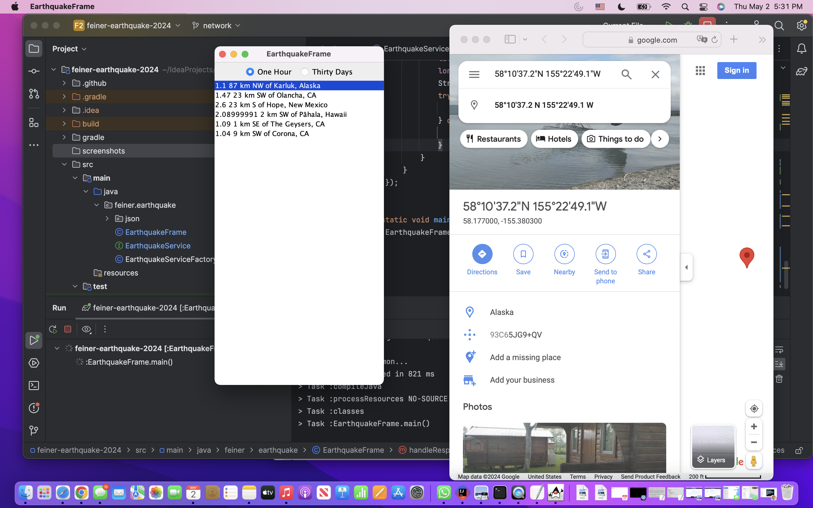

# Earthquakes

Application to display Recent Earthquake data by querying [Earthquake USGS](https://earthquake.usgs.gov/earthquakes/feed/v1.0/geojson.php) using RxJava, Retrofit and GSON.

# Technology
[One Hour JSON](https://earthquake.usgs.gov/earthquakes/feed/v1.0/summary/1.0_hour.geojson)  
[30 Days JSON](https://earthquake.usgs.gov/earthquakes/feed/v1.0/summary/significant_month.geojson)